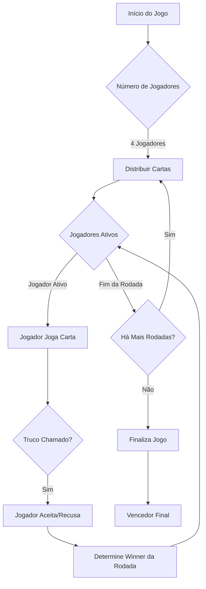
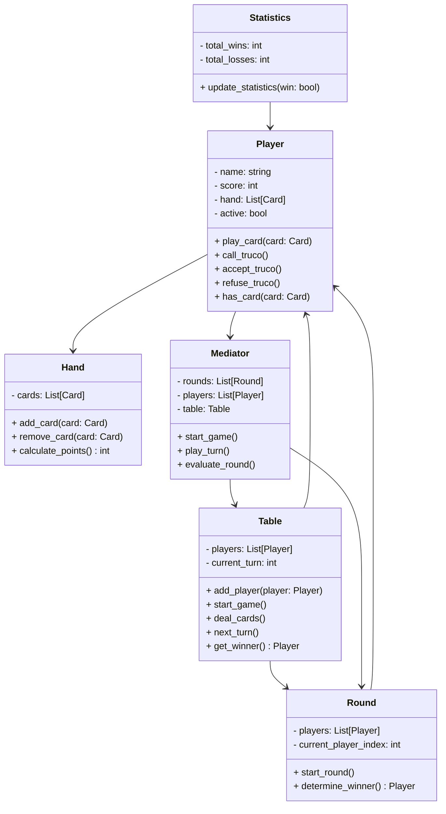

# Jogo de Truco - Documentação do Projeto

Este projeto implementa um jogo de **Truco**, estruturado utilizando princípios de **Programação Orientada a Objetos (POO)** e **Design Patterns**. Abaixo, estão descritas as principais *models* do projeto e suas responsabilidades.

---

## Estrutura das Models

### 1. **Hand**
A classe `Hand` representa a mão de um jogador, contendo as cartas que ele possui em um determinado momento do jogo.

#### Métodos:
- `add_card(card: Card)`: Adiciona uma carta à mão do jogador.
- `remove_card(card: Card)`: Remove uma carta específica da mão.
- `calculate_points() -> int`: Calcula os pontos baseados nas cartas presentes na mão.

---

### 2. **Player**
A classe `Player` representa um jogador no jogo, incluindo seu nome, pontuação, status ativo e ações disponíveis durante o jogo.

#### Atributos:
- `_name` (str): Nome do jogador.
- `score` (int): Pontuação acumulada do jogador.
- `hand` (List[Card]): Cartas na mão do jogador.
- `active` (bool): Define se o jogador está ativo no jogo.
- `mediator` (obj): Referência ao mediador responsável por coordenar as interações entre os jogadores.

#### Métodos principais:
- `play_card(card: Card)`: Permite que o jogador jogue uma carta de sua mão.
- `call_truco()`: Grita "Truco" no jogo.
- `accept_truco()`: Aceita o desafio de Truco.
- `refuse_truco()`: Recusa o desafio de Truco.
- `has_card(card: Card) -> bool`: Verifica se o jogador possui uma carta específica em sua mão.

---

### 3. **Round**
A classe `Round` gerencia as rodadas do jogo, controlando os jogadores ativos, as cartas jogadas e a definição do vencedor da rodada.

#### Atributos:
- `players` (List[Player]): Lista de jogadores participantes da rodada.
- `current_player_index` (int): Índice do jogador cuja vez é de jogar.
- `played_cards` (List[Card]): Cartas jogadas na rodada.
- `mediator` (obj): Mediador para coordenar os eventos da rodada.

#### Métodos:
- `start_round()`: Inicia uma nova rodada.
- `determine_winner() -> Player`: Determina o vencedor da rodada.

---

### 4. **Statistics**
A classe `Statistics` é responsável por armazenar e atualizar estatísticas dos jogadores.

#### Atributos:
- `total_wins` (int): Total de vitórias acumuladas.
- `total_losses` (int): Total de derrotas acumuladas.

#### Métodos:
- `update_statistics(win: bool)`: Atualiza as estatísticas do jogador baseado no resultado da partida (vitória ou derrota).

---

### 5. **Table**
A classe `Table` representa a mesa onde o jogo acontece, gerenciando jogadores e turnos.

#### Atributos:
- `players` (List[Player]): Lista de jogadores na mesa.
- `current_turn` (int): Índice do jogador cujo turno é ativo.

#### Métodos principais:
- `add_player(player: Player)`: Adiciona um jogador à mesa, desde que o limite de 4 jogadores não seja excedido.
- `start_game()`: Inicia o jogo, verificando se há jogadores suficientes.
- `deal_cards()`: Distribui as cartas entre os jogadores.
- `next_turn()`: Avança para o próximo turno.
- `get_winner() -> Player`: Determina o vencedor do jogo.
- `current_players() -> List[Player]`: Retorna a lista de jogadores atuais na mesa.

---

### 6. **Mediator**
O padrão **Mediator** é utilizado para facilitar a comunicação entre as diversas partes do jogo, como jogadores, rodadas e a mesa. A classe `Mediator` é responsável por orquestrar as interações entre os jogadores, garantindo que as ações sejam executadas de forma coordenada e sem que as classes se comuniquem diretamente entre si.

#### Atributos:
- `rounds` (List[Round]): Lista de rodadas do jogo.
- `players` (List[Player]): Lista de jogadores envolvidos no jogo.
- `table` (Table): A mesa onde o jogo acontece.

#### Métodos:
- `start_game()`: Inicia o jogo, organizando os jogadores e começando as rodadas.
- `play_turn()`: Gerencia a jogada de um jogador, avançando para o próximo turno.
- `evaluate_round()`: Avalia o resultado de uma rodada, determinando o vencedor e atualizando as estatísticas.

---

## Fluxo do Jogo



---

## Relacionamento entre Classes



---

## Como Iniciar o Jogo

Para começar a jogar o Truco, siga os passos abaixo:

1. **Crie os jogadores**. Você pode ter até 4 jogadores na mesa.
   
   ```python
   player1 = Player(name="Jogador 1")
   player2 = Player(name="Jogador 2")
   player3 = Player(name="Jogador 3")
   player4 = Player(name="Jogador 4")
   ```

2. **Crie a mesa e adicione os jogadores**. A mesa gerenciará o jogo e os turnos.

   ```python
   table = Table()
   table.add_player(player1)
   table.add_player(player2)
   table.add_player(player3)
   table.add_player(player4)
   ```

## Como Clonar o Repositório

Para clonar este repositório, siga os passos abaixo:

1. **Abra seu terminal**.

2. **Clone o repositório com o comando**:

   ```bash
   git clone https://github.com/design-patterns-project/trick-game
   ```

3. **Navegue até o diretório do projeto**:

   ```bash
   cd trick-game
   ```

Agora você pode começar a trabalhar no projeto ou rodar o jogo!

---

## Padrões de Projeto Utilizados

O jogo de Truco foi estruturado com base nos seguintes **Design Patterns**:

1. **Mediator**: A comunicação entre as classes `Player`, `Round` e `Table` é orquestrada por meio do padrão **Mediator**, que facilita a interação entre os objetos sem que eles precisem se comunicar diretamente entre si.

2. **Factory Method**: Pode ser utilizado para criar objetos como `Card` e `Player`, permitindo que novas instâncias sejam geradas sem precisar se preocupar com sua implementação detalhada.

3. **Observer**: Pode ser aplicado para monitorar mudanças no estado

 do jogo e notificar os jogadores sobre eventos importantes.

---

## Contribuintes

Alunos do 4º Semestre de Análise e Desenvolvimentos de Sistemas - Senai Gaspar Ricardo Júnior - 2024

- Carlos Henrique Magalhães dos Santos

- Felipe Moreira

- Rafael Rodrigues

---

Este é o guia completo do projeto de Truco. Divirta-se e aproveite o jogo!
